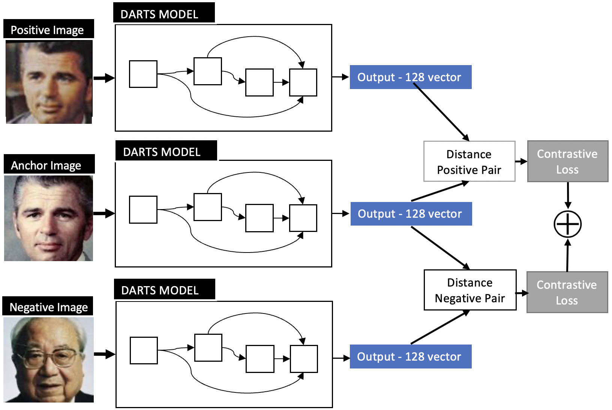

# Differentiable Architecture Search For Face Verification Using Distance Metrics
### Project for L46 - Principles of Machine Learning

## Abstract
Finding the best architecture requires considerable resources and human trial and error. New approaches have shown interest in automating this task via reinforcement learning and evolutionary algorithms. However, they have been computationally expensive. A method that aims to make this process more efficient is Differentiable Architecture Search (DARTS). This method has demonstrated state of the art results on specific tasks such as image classification and language modelling, but it has not been tested in some other complex architectures such as face verification. This research aims to demonstrate the effectiveness of applying DARTS to a face verifi- cation model based on metric learning loss. The results obtained show that DARTS is able to find a model capable of reaching high accuracies in face verification tasks.

## Demo and instructions
Examples of loading the data, training and validating the models can be seen in the Colab notebook. The Colab notebook with the demo can be found in the following URL: dddddd.com

## Original DARTS implementation: 
https://github.com/quark0/darts